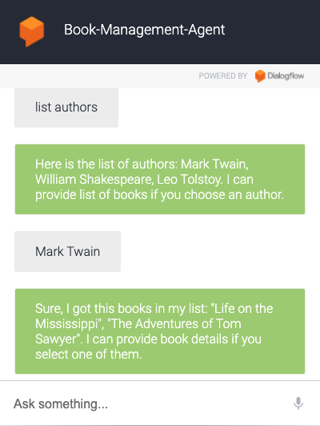

# Google Assistant Java App Development & Actions On Google Java SDK & Dialogflow & Spring Boot & MySQL & NGROK

"Book Management" is a Google Assistant application using java and Spring Boot framework. Users can interact with Google Assistant for books informations.

   

# Library and Tools

1. This project is implement by using Java Spring Boot.
2. MySQL
3. Google Assistant Service
4. Actions On Google Java - version 1.8.0
5. ngrok which transfers http to https

--------------------------------------------------------------------------------

# ngrok Commands (port 8080 to 8081)

$`./ngrok http 8080`
